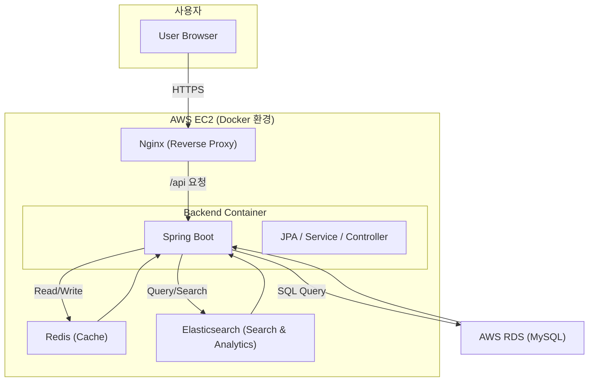

# ❄️ 눈ON (SnowNow)

**실시간 눈(강설) 감지 및 알림 웹 서비스**  
공공데이터포털의 "초단기실황" API를 활용하여 실시간 눈 정보를 감지하고,  
사용자에게 지역별 강설 현황을 시각화 및 알림으로 제공합니다.  
Redis 캐싱과 Elasticsearch 분석으로 빠르고 정확한 데이터 서비스를 구현했습니다.

---

## 🌐 Live Demo

- **웹 서비스:** [https://snownow.info](https://snownow.info)  
  (또는 [https://www.snownow.info](https://www.snownow.info))

---

## 🏛️ 프로젝트 아키텍처

AWS EC2 환경에서 Docker로 서비스들을 컨테이너 단위로 배포하고,  
Nginx를 리버스 프록시로 구성하여 트래픽을 안정적으로 관리합니다.  
Redis와 Elasticsearch를 활용해 데이터 캐싱과 검색/분석을 수행합니다.

- **Backend:** Spring Boot (Java)
- **Database:** AWS RDS for MySQL  
- **Cache:** Redis (Docker)
- **Search/Analytics:** Elasticsearch (Docker)
- **Infra:** AWS EC2 + Nginx + Docker

---

## ✨ 주요 기능

### 🌨️ 실시간 눈 감지
- 공공데이터포털 “초단기실황” API 기반  
- 지역별 실시간 강설 여부 분석  
- Redis 캐싱으로 API 호출 횟수 최소화 및 응답 속도 향상  

### 📊 데이터 저장 및 분석
- Elasticsearch 기반의 강설 데이터 수집, 검색, 통계 분석  
- MySQL에 지역 및 기상 이력 관리  

### ⚙️ 백엔드 (Spring Boot)
- RESTful API 설계 및 서비스 계층 구조화  
- JPA로 MySQL 연동  
- Redis 캐싱 + Elasticsearch 연계  
- 스케줄러 기반 자동 데이터 수집  

---

## 💻 기술 스택

### Backend

### Infra

---

## 💡 문제 해결 경험

### 1️⃣ 공공데이터 API 호출 지연 문제
- **문제:** 초단기실황 API의 응답 속도 및 트래픽 제한으로 서비스 지연 발생  
- **해결:** Redis 캐싱을 통해 최신 데이터 유지 및 외부 API 호출 최소화  

---

### 2️⃣ 데이터 검색 성능 및 필터링 문제
- **문제:** 강설 데이터가 누적됨에 따라 검색 및 통계 처리 속도 저하 및 오타가 있을 시 문제 발생 
- **해결:** Elasticsearch를 도입하여 빠른 검색 및 필터링 구현  

---

### 3️⃣ 배포 환경 통합 및 트래픽 관리
- **문제:** 다중 서비스 관리 필요(Redis, Elasticsearch, FE, BE)
- **해결:** Docker Compose 기반 컨테이너 통합 관리 + Nginx 리버스 프록시 설정  

---
